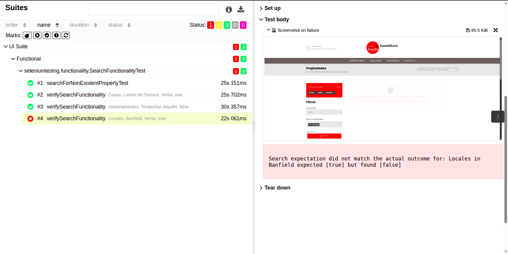

# QA Automation Framework - Selenium & Java

[](https://github.com/vinelis/qa-web-ui-java/actions/workflows/allure-report.yml)     

This project is a comprehensive UI test automation framework designed to validate the functionality of a real estate web application. It was built from the ground up as a portfolio piece to showcase best practices in modern software testing, including Page Object Model, BDD with Cucumber, and advanced reporting with Allure.

The framework is architected to be **robust, scalable, and easily maintainable**, making it suitable for real-world enterprise applications.

---

## 🚀 Features

* **Page Object Model (POM)**: Cleanly separates test logic from UI interaction, making tests easier to read and maintain.
* **Layered Architecture**: Clear separation between test layers (UI, business logic) for better organization.
* **Advanced Reporting**: Integrated with **Allure Report** to generate beautiful, detailed, and interactive test execution reports.
* **Automatic Screenshots on Failure**: **AllureListener** (TestNG) captures a screenshot when a test fails and attaches it to the Allure report. It obtains the WebDriver from the test instance (TestNG) or from **DriverHolder** (ThreadLocal) when the test runs under Cucumber, so screenshots work for both runners.
* **Behavior-Driven Development (BDD)**: Utilizes **Cucumber** and Gherkin syntax (`.feature` files) to write tests in a human-readable format, covering happy paths, empty fields, and invalid data scenarios.
* **Data-Driven Testing**: Employs TestNG's `DataProvider` for traditional tests and Cucumber `Examples` tables for BDD scenarios to run the same test logic with multiple datasets.

---

## ✅ Implemented Test Scenarios

The framework currently automates key end-to-end flows and validation cases, such as:

- **Search Functionality**
    - Property search by location, type, and operation (e.g., house for sale).
    - Validation of "no results" messages when no properties match.
    - Data-driven search scenarios via TestNG DataProvider.

- **Property Details**
    - Opening a property detail page from search results.
    - E2E flow: search → results → property detail → contact form with persisted data.

- **Contact Form**
    - Filling in and verifying form fields with user data (BDD scenario).
    - Validation of form persistence and input correctness.
    - Validation of empty required fields and invalid email format (TestNG and Cucumber).

These cover both **happy paths** and **negative cases**, ensuring functional validation and resilience of the UI.

---

## 🛠️ Tech Stack

* **Language**: Java 17
* **Browser Automation**: Selenium 4
* **Test Runner**: TestNG
* **Build Tool**: Maven
* **Reporting**: Allure Report
* **BDD Framework**: Cucumber
* **WebDriver Management**: WebDriverManager

---

## ⚙️ Getting Started

### Prerequisites

* Java JDK 17 or higher installed.
* Apache Maven installed.
* A compatible web browser (e.g., Google Chrome).

---

## ⚡ Running the Tests

You can run the entire test suite using the following Maven command. The tests will execute as defined in the `testng.xml` file.

```sh
mvn clean test
```

---

## 📊 Viewing the Allure Report

After running the tests, Allure results will be generated in the `allure-results` directory. To view the HTML report locally, run:

```sh
allure serve
```

This will generate the report and open it in your default web browser.

The report is also published automatically to **GitHub Pages** on each run of the CI pipeline (GitHub Actions): **[https://vinelis.github.io/qa-web-ui-java/](https://vinelis.github.io/qa-web-ui-java/)**



---

## 👤 Author

* **[Luca Vinelli]**
* **LinkedIn**: `https://www.linkedin.com/in/luca-vinelli-723291351/`
* **GitHub**: `https://github.com/vinelis`
